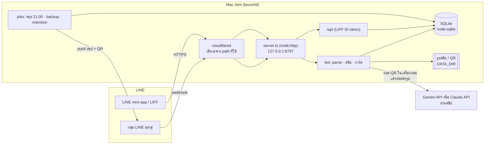

# หารกัน (harnkan)

LINE bot + mini app ที่ช่วยคนสองคนหารค่าใช้จ่ายรายวัน แล้วสรุปเป็น **ยอดโอนเดียวต่อวัน**

> พิมพ์ "กาแฟ 90" หรือส่งสลิปในกลุ่ม LINE → บอทบันทึกและหารครึ่ง → 21:00 สรุปยอดเดียว + QR พร้อมเพย์ → ส่งสลิปโอนกลับ → ปิดยอด

[](https://github.com/boonarit/harnkan/actions/workflows/ci.yml)

## ปัญหา

คู่ที่ใช้เงินด้วยกันทุกวันมักจบแบบใดแบบหนึ่ง: โอนกันทุกบิล (วันละ 5–10 ครั้ง) · จดในโน้ตแล้วลืม · หรือใช้แอปหารบิลที่ต้องเปิดแยกจนเลิกใช้ภายในสัปดาห์
หารกันอยู่ในแชท LINE ที่คู่คุยกันอยู่แล้ว ไม่ต้องเปิดแอปเพิ่มเพื่อจด และปิดยอดวันละครั้งด้วยการโอนครั้งเดียว

## ภาพหน้าจอ

<!-- ผู้ดูแล: ใช้ภาพจากโหมดเดโม (ข้อมูลสมมติ) เท่านั้น · อัปโหลดรูปผ่าน GitHub (ลากลงช่องคอมเมนต์ของ issue) แล้ววางลิงก์ด้านล่าง
     ห้าม commit ไฟล์รูปในรีโป (npm run check จะไม่ผ่าน) และห้ามใช้ภาพที่มีชื่อ/เบอร์/สลิปจริง -->

| แชทในกลุ่ม | สรุป 21:00 | mini app: วันนี้ | mini app: เคลียร์ยอด |
|---|---|---|---|
| _(ใส่ภาพ)_ | _(ใส่ภาพ)_ | _(ใส่ภาพ)_ | _(ใส่ภาพ)_ |

ลองเองได้ทันทีในโหมดเดโม: `npm run demo` แล้วเปิด `http://127.0.0.1:8788/demo/`

## ตัวอย่าง 1 วัน

| เวลา | รายการ | จ่ายโดย | หาร | บี ค้าง เอ | เอ ค้าง บี |
|---|---|---|---|---|---|
| 08:10 | กาแฟ 2 แก้ว 90 | เอ | ครึ่ง | 45.00 | – |
| 12:30 | ข้าวกลางวัน 240 | บี | ครึ่ง | – | 120.00 |
| 18:45 | 7-Eleven 127 (สลิป) | เอ | ครึ่ง | 63.50 | – |
| 19:10 | ครีมกันแดด 359 (ใบเสร็จ) | เอ | ของบี | 359.00 | – |
| 20:00 | ข้าวเย็น 420 | บี | เลี้ยง | – | – |

**21:00 → บี โอนให้ เอ ฿347.50 ครั้งเดียว** (ทั้งวันนี้เป็นเทสต์ end-to-end ใน `test/e2e/day.test.ts`)

## สถาปัตยกรรม



- `src/domain/` — เงิน การหาร ยอดสุทธิ parse ข้อความ (pure JS ใช้ร่วมกันทั้ง server, mini app และเดโม)
- `src/db/` — schema + migrations + Repo (ทุกการแก้/ลบเขียน audit log)
- `src/line/` — ตรวจลายเซ็น, client จริง/fake, router, Flex message
- `src/slip/` — ถอด QR, อ่านด้วย AI (Gemini ค่าเริ่ม / Claude / fake), จัดประเภท
- `src/api/` — REST สำหรับ mini app · `public/app/` — mini app (HTML + ES modules ไม่มี build) · `demo/` — โหมดเดโม static

## สูตรหาร

เงินเก็บเป็น **สตางค์ (integer)** ทุกที่ · ยอดสุทธิ (บวก = บีต้องโอนให้เอ):

```
N = Σ ส่วนของบีในบิลที่เอจ่าย − Σ ส่วนของเอในบิลที่บีจ่าย + ยอดยกมา − ที่บีโอนให้เอแล้ว + ที่เอโอนให้บีแล้ว
```

| โหมด | ความหมาย |
|---|---|
| `half` | 50/50 (ค่าเริ่มต้น) · เศษสตางค์คี่สลับกันรับตามลำดับรายการ |
| `mine` | ของคนจ่ายเอง |
| `theirs` | ของอีกคนทั้งหมด |
| `treat` | เลี้ยง — บันทึกไว้แต่ไม่นับเข้ายอด |
| `ratio` | สัดส่วน เช่น 60/40 |

ยอดต่ำกว่าขั้นต่ำ (ค่าเริ่ม ฿50) ทบไปวันถัดไป · แก้รายการของวันที่ปิดยอดแล้ว → สร้างยอดปรับปรุงเข้าวันนี้ ไม่แก้สรุปเก่า

## วิธีรัน

ต้องมี Node ≥ 22.6

```sh
npm ci
npm test
npm run check
```

**dev (ไม่ต่อ LINE / AI จริง):**

```sh
npm run dev:seed
npm run dev
```

แล้วเปิด `http://127.0.0.1:8787/app/?as=U_fake_a` (สลับเป็นอีกคนด้วย `?as=U_fake_b`)

**เดโม (static ล้วน ข้อมูลอยู่ในเบราว์เซอร์):**

```sh
npm run demo
```

แล้วเปิด `http://127.0.0.1:8788/demo/` · deploy ขึ้น Cloudflare Pages ได้ (ดู `docs/DEPLOY.md`)

| คำสั่ง | ทำอะไร |
|---|---|
| `npm run dev` | server โหมด fake ที่ `127.0.0.1:8787` |
| `npm test` | เทสต์ทั้งหมด (ไม่ต่อเน็ต) |
| `npm run check` | ตรวจความลับ ข้อมูลส่วนตัว และ API นอก Node 22 |
| `npm run job:summary` | งานสรุปยอด 21:00 |
| `npm run job:backup` / `job:retention` | สำรอง DB / ลบรูปเก่า |
| `npm run demo` | เสิร์ฟโหมดเดโม |

## เอกสาร

- การตัดสินใจ: [001 LINE-first](docs/decisions/001-line-first.md) · [002 SQLite](docs/decisions/002-sqlite.md) · [003 เงินเป็นสตางค์](docs/decisions/003-satang.md) · [004 ถอด QR ก่อน AI](docs/decisions/004-qr-before-ai.md) · [005 ไม่ใช้ Docker](docs/decisions/005-no-docker.md) · [006 Gemini อ่านสลิป](docs/decisions/006-gemini.md)
- [ติดตั้งบน Mac mini](docs/DEPLOY.md) · [ใส่ credential](docs/SETUP-CREDENTIALS.md) · [ความเป็นส่วนตัว](docs/PRIVACY.md) · [แผนงาน](docs/PLAN.md) · [CHANGELOG](docs/CHANGELOG.md)

## License

MIT © boonarit
